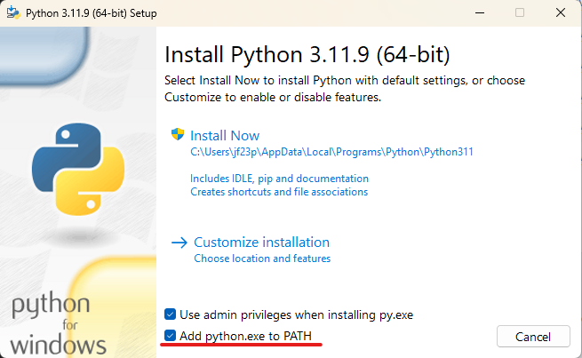

# Club de Data Science & Engineering USAC
## Descripción general
Introducción práctica y acelerada a los fundamentos de la Ciencia de Datos e Ingeniería de
Datos. Se cubren herramientas esenciales (GitHub, Pandas, SciKit-Learn, Tensorflow), modelos clásicos de regresión y clasificación, ensambles basados en árboles, y dos sesiones finales dedicadas a redes neuronales (desde perceptrones y convoluciones hasta un caso práctico con CNN).

## Resultados de aprendizaje
Al finalizar, la persona participante será capaz de:
* Preparar datos con la librería de python *pandas* y versionar proyectos con GitHub.
* Entrenar y evaluar modelos de regresión y clasificación con la librería de python *scikit-learn*.
* Aplicar ingeniería de características y técnicas de regularización.
* Emplear árboles de decisión y métodos de ensamble (Random Forest, Gradient Boosting).
* Comprender y entrenar redes neuronales (MLP y CNN) con TensorFlow / Keras.

## Requisitos del participante
Conocimientos básicos de Python. Se recomienda tener instalado *Python 3.10+*, manejo de ambientes con python y un entorno de desarrollo como *Visual Studio Code*.

## Instalación de herramientas
### Visual Studio Code
Descargar e instalar la herramienta desde el siguiente [enlace](https://code.visualstudio.com/sha/download?build=stable&os=win32-x64-user).

### Instalar extensiones en Visual Studio Code
Las siguientes extensiones serán necesarias:
* Jupyter
* Python
* Git


### GIT
Descargar e instalar la herramienta desde el siguiente [enlace](https://git-scm.com/downloads/win).  
Se debe seleccionar *Visual Studio Code* como editor de texto por defecto durante la instalación.  


### Python
Ingresar a la página oficial de **Python** y descargar la versión [**3.11.9**](https://www.python.org/downloads/release/python-3119/) e instalar.

#### Descargar paquete correcto de python

#### Añadir Python al path de Windows

Esto es necesario para poder ejecutar el programa desde la línea de comandos.
#### Deshabilitar el tamaño máximo del path en variables de Windows


#### Verificar instalación 
En una consola de *Símbolo de Sistema* se debe ejecutar el siguiente comando:
```
python --version
```
Y el resultado debería ser el siguiente:


### Crear ambiente virtual en Python
Un **ambiente virtual de Python** (o virtual environment) es una herramienta que permite crear un entorno aislado para ejecutar proyectos en Python, con sus propias dependencias (librerías, versiones, etc.), sin afectar el resto del sistema o a otros proyectos.  
Utilizaremos la librería *virtualenvwrapper* para crear nuestro ambiente virtual mediante los siguientes pasos:
1. Instalar la librería
```bash
pip install virtualenvwrapper-win
```
2. Creación del ambiente virtual llamado *ds-club*
```bash
mkvirtualenv ds-club
```

3. Seleccionar el ambiente virtual creado
```bash
workon ds-club
```
4. Instalar las dependencias necesarias en el ambiente virtual
```bash
pip install -r requirements.txt
```
